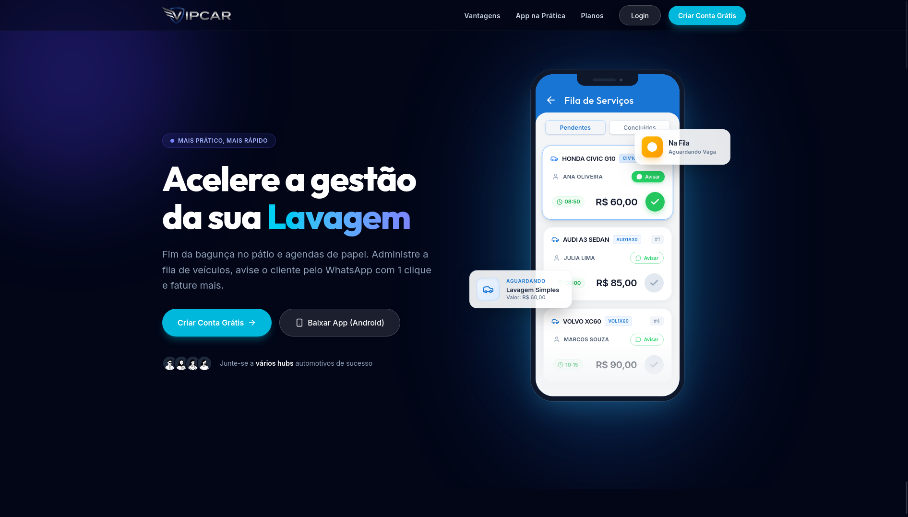

# 🚗 VIP Car - Web App & Site Institucional

<div align="center">
  
</div>

<br />

<div align="center">

  **🔗 Link de Produção:** [https://vip-car-website.vercel.app/](https://vip-car-website.vercel.app/)

  [](https://vip-car-website.vercel.app/)
  &nbsp;
  [](https://react.dev/)
  &nbsp;
  [](https://tailwindcss.com/)

</div>

---

## 📋 Visão Geral

Este é o repositório da página institucional e painel web do **VIP Car** (plataforma de controle e gestão para estéticas automotivas e lava rápidos). 

Este documento serve para guiar a equipe interna no desenvolvimento local e nas diretrizes de manutenção do projeto.

---

## 🛠️ Stack Tecnológica

O projeto foi construído utilizando as seguintes ferramentas de desenvolvimento:

* **React 19 & TypeScript** — Framework e tipagem estática.
* **Vite 6** — Ferramenta de build e servidor de desenvolvimento ultra-rápido.
* **Tailwind CSS v4** — Framework CSS utilitário de última geração (responsável por todo o visual moderno, mesh gradients de fundo e responsividade da interface).
* **Motion 12** — Biblioteca utilizada para as micro-animações do pátio e transições fluidas de tela.
* **Lucide React** — Conjunto de ícones vetoriais.

---

## 🚀 Como Executar Localmente

Siga as orientações abaixo para subir o ambiente de desenvolvimento em sua máquina:

### 1. Instalar Dependências
```bash
npm install
```

### 2. Configurar Variáveis de Ambiente
Crie um arquivo `.env` na raiz do projeto (use o `.env.example` como guia) e configure o endereço do backend:
```env
VITE_API_URL=http://localhost:3000
```

### 3. Rodar o Servidor Local
```bash
npm run dev
```
O projeto estará disponível localmente em: **http://localhost:5173**

---

## ⚡ Deploy e Integração Contínua (Vercel)

* **Deploy Automático:** Qualquer alteração ou correção enviada (push) para a ramificação `main` dispara o deploy contínuo de produção na **Vercel** automaticamente.
* **Produção:** O site de produção está ativo em [https://vip-car-website.vercel.app/](https://vip-car-website.vercel.app/).
* **Variaveis de Produção:** Lembre-se de configurar a variável `VITE_API_URL` apontando para a URL da API de produção diretamente na dashboard da Vercel (Configurações do Projeto > Environmental Variables). O comportamento de rotas está segurado pelo arquivo [vercel.json](./vercel.json).
