# Relatório de Auditoria: Performance, UI/UX e Métricas de Negócio — Viper Car

Este relatório apresenta uma análise aprofundada da página institucional do **Viper Car**, avaliando a qualidade de design (**UI/UX**), a eficiência técnica (**Performance**) e recomendando melhorias e métricas de mercado utilizadas por empresas de tecnologia SaaS para mensurar o sucesso de seus produtos.

---

## 1. Análise de UI (Visual Design) e UX (Experiência do Usuário)

O website do Viper Car apresenta uma proposta de valor clara e um design moderno. A página é estruturada sob uma estética *dark mode* premium, utilizando gradientes cibernéticos e um layout de grade dinâmico (estilo *Bento Grid*) que é tendência em produtos SaaS modernos.

### 1.1 Pontos Fortes de UI/UX
* **Primeira Impressão de Alto Nível:** A combinação de cores escuras (`#020617`), tons de ciano (`#06b6d4`) e índigo traz um ar tecnológico e profissional que combina perfeitamente com o segmento automotivo moderno.
* **Simulador Interativo da Hero e Funcionalidades:** A inclusão de um celular simulado interativo na seção de funcionalidades é um dos maiores trunfos da página. Em vez de apenas ler sobre o produto, o usuário pode clicar nas abas ("Pátio", "Cadastro", "Despesas") e ver a interface simulada reagir em tempo real. Isso reduz drasticamente o atrito cognitivo e aumenta o engajamento.
* **Tipografia e Hierarquia Visual:** A fonte de exibição **Outfit** para títulos combinada com a legibilidade da **Inter** para textos corridos funciona muito bem. Os títulos usam pesos fortes (`font-extrabold`), ajudando a orientar a leitura rápida (escaneabilidade).
* **CTA Direto:** Os botões de chamada para ação (como "Criar Conta Grátis") estão bem visíveis na dobra superior (Hero) e no rodapé, acompanhados de botões para download direto do aplicativo Android (APK).

### 1.2 Oportunidades de Melhoria em UI/UX
* **Semântica de Acessibilidade:** Vários botões interativos e abas de simulação não possuem papéis (`role="tab"`) ou propriedades ARIA corretas para leitores de tela.
* **Consistência de Interação (Feedback Visual):** Nos botões do simulador de celular, a transição entre telas é abrupta quando o usuário clica nas abas laterais fora do celular. Um breve indicador de transição ou animação de carregamento simulado traria mais sofisticação.
* **Instrução de Uso no Simulador:** Usuários novatos podem não perceber de imediato que a seção de "Recursos" é um simulador interativo. Um pequeno microtexto como *"Clique nas abas para interagir"* aumentaria a taxa de clique (CTR).

---

## 2. Auditoria de Performance e Engenharia de Frontend

A performance técnica afeta diretamente as taxas de conversão de anúncios pagos e o posicionamento orgânico no Google (SEO). A otimização recente de mover a animação de flutuação e escala da Hero para CSS puro foi um passo crucial, mas há outros gargalos técnicos a serem observados.

### 2.1 Análise de Core Web Vitals (CWV)

```mermaid
gantt
    title Cronologia de Carregamento & Interação (Projeção)
    dateFormat  X
    axisFormat %s s
    section Carregamento
    Primeira Resposta (TTFB)       :active, 0, 1
    Renderização Inicial (FCP)      :active, 1, 2
    Carregamento de Fontes Google  : 1.5, 3
    section Core Web Vitals
    Largest Contentful Paint (LCP)  :crit, 2.5, 3.5
    Estabilização de Layout (CLS)   : 1, 3
    Pronto para Interação (INP)     : 3.5, 4.5
```



1. **LCP (Largest Contentful Paint - Maior Pintura de Conteúdo):**
   * *Diagnóstico:* Na dobra superior (Hero), o maior elemento visível é o container do celular simulado ou o título principal. A importação de fontes externas via CSS `@import url(...)` na primeira linha do `index.css` atrasa o carregamento de texto do título, gerando um efeito de texto invisível (FOIT) ou sem estilo (FOUT) temporário.
2. **INP (Interaction to Next Paint - Interação para Próxima Pintura):**
   * *Diagnóstico:* O arquivo `App.tsx` possui mais de 4.100 linhas de código estruturadas em um único componente gigante contendo toda a lógica de renderização, modais e o estado do simulador do aplicativo. Como tudo reside em um único bundle de script, qualquer alteração de estado no simulador faz com que o React 19 avalie a árvore do componente principal, elevando o tempo de bloqueio de CPU.
3. **CLS (Cumulative Layout Shift - Mudança Cumulativa de Layout):**
   * *Diagnóstico:* Os avatares de demonstração na Hero e ícones de serviços usam fontes e imagens dinâmicas sem dimensões explícitas de largura e altura (`width` e `height`) especificadas no HTML, o que pode causar leves deslocamentos de layout durante a renderização inicial.

### 2.2 Estrutura do Bundle e Otimização de Código
* **Código Monolítico:** A concentração de 170KB+ de código de componentes React em um único arquivo (`App.tsx`) impede o empacotador (Vite/Rollup) de realizar o **Code-Splitting** (divisão de código). Páginas institucionais de alto desempenho carregam apenas o HTML/CSS crítico e carregam os modais pesados (como o formulário de Login/Signup e o simulador interativo) de forma assíncrona (via `React.lazy` ou importações dinâmicas).
* **Carregamento de Fontes:** Atualmente, as fontes do Google Fonts estão sendo importadas via CSS:
  ```css
  @import url('https://fonts.googleapis.com/css2?family=Inter:wght@400;500;600&family=Outfit:wght@500;600;700;800&display=swap');
  ```
  Isso cria uma cadeia de requisições crítica: o navegador baixa o HTML -> descobre o script/css -> baixa o CSS -> descobre o link da fonte externa -> faz o handshake DNS do Google Fonts -> baixa a fonte.

---

## 3. Métricas de Negócio e Métricas de Produto (Padrão Enterprise SaaS)

Empresas maduras de software como serviço (SaaS) não monitoram apenas a velocidade do site; elas medem o impacto das interações em taxas de conversão de receita. Abaixo estão as principais métricas que o Viper Car deve monitorar ativamente:

### 3.1 Métricas de Aquisição & Funil (Growth Marketing)
| Métrica | O que mede | Como implementar no Viper Car |
| :--- | :--- | :--- |
| **Signup Conversion Rate (CR)** | Porcentagem de visitantes que clicam em "Criar Conta Grátis" e completam o cadastro. | Disparar eventos no Google Analytics / Mixpanel ao enviar o formulário de cadastro. |
| **App Download Rate** | Taxa de conversão de cliques no botão "Baixar App (APK)". | Monitorar cliques no link de download da release v2.0.6. |
| **Cost Per Acquisition (CPA)** | Quanto custa trazer um usuário cadastrado via anúncios (Meta Ads, Google Ads). | Integrar o Pixel do Meta e a Tag do Google no site. |

### 3.2 Métricas de Engajamento do Produto (Product-Led Growth - PLG)
Como o Viper Car possui um simulador do sistema na própria landing page, essa página funciona como um canal de experimentação direta (PLG):

* **Simulator Interaction Rate (Taxa de Interação com o Simulador):** Porcentagem de usuários que clicam em pelo menos 2 abas do simulador de celular. Indica se o usuário entendeu a proposta interativa e se interessou pelo funcionamento do aplicativo.
* **Feature Interest Distribution (Distribuição de Interesse por Recurso):** Mapear quais abas do simulador (Pátio, IA, Despesas) recebem mais cliques. Se 70% dos usuários clicam em "Pátio", esse é o seu principal argumento de venda (*Aha! Moment*).
* **Rage Clicks (Cliques de Raiva):** Monitoramento via ferramentas como *Clarity* ou *Hotjar* de cliques rápidos e repetidos no mesmo local. Útil para identificar se algum botão do simulador parece clicável mas não realiza ações, ou se há travamentos nas telas.

---

## 4. Recomendações de SEO (Search Engine Optimization)

* **Meta Tags e SEO Local:** Para um sistema de gerenciamento de lava-rápido, há uma grande oportunidade em SEO Local e buscas orgânicas de nicho. O site atual carece de metadados ricos para redes sociais (Open Graph para WhatsApp/Facebook) e tags estruturadas (Schema.org) do tipo `SoftwareApplication`.
* **Hierarquia semântica:** A utilização correta do fluxo de títulos (`H1` -> `H2` -> `H3`) ajuda os robôs de busca a estruturarem a relevância do seu site. A página possui boa semântica, mas a separação de seções em tags `<section>` explícitas com `aria-label` facilitaria a indexação.

---

## 5. Plano de Ação Recomendado (Next Steps)

Para transformar o website do Viper Car em uma máquina de conversão extremamente rápida e otimizada, sugerimos o seguinte cronograma de tarefas de engenharia:

### Passo 1: Melhoria de LCP e Tempo de Carregamento Inicial (Fácil)
Substituir a diretiva `@import` do CSS por tags de carregamento direto no `<head>` do arquivo [index.html](file:///home/gangplank/projects/viper-car-website/index.html) para pré-conectar os servidores do Google Fonts:
```html
<link rel="preconnect" href="https://fonts.googleapis.com">
<link rel="preconnect" href="https://fonts.gstatic.com" crossorigin>
<link href="https://fonts.googleapis.com/css2?family=Inter:wght@400;500;600&family=Outfit:wght@500;600;700;800&display=swap" rel="stylesheet">
```

### Passo 2: Refatoração e Divisão de Código (Médio)
Dividir o arquivo monolith [App.tsx](file:///home/gangplank/projects/viper-car-website/src/App.tsx) em sub-componentes modulares e isolados:
* `/src/components/HeroSection.tsx`
* `/src/components/InteractiveSimulator.tsx` (Contendo as telas simuladas)
* `/src/components/PricingSection.tsx`
* `/src/components/LoginModal.tsx` (Carregado de forma assíncrona/lazy)

Isso reduzirá o tamanho do bundle principal baixado no primeiro acesso, melhorando os scores de performance móvel de 60 para 90+.

### Passo 3: Implementação de Telemetria de Eventos (Estratégico)
Adicionar um gerenciador de tags (como o Google Tag Manager) para trackear:
1. Cliques em `Criar Conta Grátis`
2. Cliques em `Baixar App`
3. Troca de abas no simulador interativo (avaliar o engajamento da demo)
